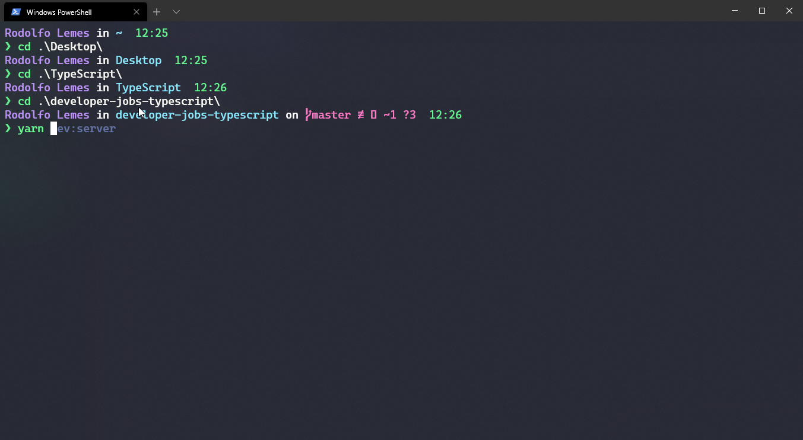

# my-windows-terminal-config



## Requirements

* Windows Terminal
* [Cascadia Font](https://www.nerdfonts.com/) or whatever font you like,
I recommend [Jetbrains Mono](https://www.jetbrains.com/pt-br/lp/mono/).

## Features

* Show de currently user;
* Show de currently directory;
* Show git status -> currently branch and archives status;
* Show timestamp;
* Autocomplete commands;
* command `ls` like linux bash;

## Installation

The instalation is based the gist: [otonni/oh-my-posh.md](https://gist.github.com/otonii/8f8f7d002a3674614d212d9aa593e8f6). With some corrections:

* `Set-Prompt` just work after you run:
```bash
Install-Module -Name PSReadLine -AllowPrerelease -Scope CurrentUser -Force -SkipPublisherCheck
```

* `Set-Theme` command doesn't work is this version of `oh-my-posh`, use:
```
Set-PoshPrompt
```

* Copy and Paste the file `Microsoft.PowerShell_profile.ps1` in the `$PROFILE`, I made some changes.

* The theme I has not managed to do like the tutorial, so I made one. It's a modification
of the `star` theme already in the `oh-my-posh`. So, in the directory `./Modules/oh-my-posh/../themes`, 
copy and paste `star` theme present in the repository `themes/`.

* For the settings file of the windows terminal, copy and paste of the repository `settings-windows-terminal.json`.

## Problems

I couldn't remove this **strange and square symbols** that may appear, it's because of the font you will use and the encode utf8.
I would love some solution to display this symbols correctly.